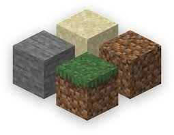
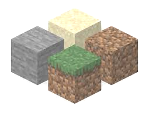
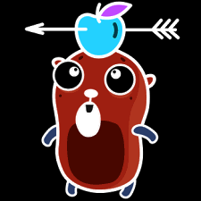
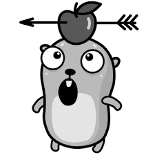

# Отчет по разработке компилятора языка ImgLang

**ImgLang** — это статически типизированный язык программирования, ориентированный на обработку изображений и реализацию алгоритмов компьютерного зрения. Компилятор транслирует исходный код в промежуточный язык **.NET CIL (Common Intermediate Language)**, который затем собирается в исполняемый файл (.exe).

_Свойства языка согласно варианту:_
1. Объявление переменных - явное;
2. Преобразование типов - явное, например, a = (int) b;
3. Оператор присваивания - многоцелевой, например, a, b = c, d;
4. Структуры, ограничивающие область видимости - подпрограммы и
блочные операторы;
5. Маркер блочного оператора - явные, например {} или begin end;
6. Условные операторы - двухвариантный оператор if-then-else;
7. Перегрузка подпрограмм - присутствует;
8. Передача параметров в подпрограмму - по значению и результату;
9. Допустимое место объявления подпрограмм - в начале программы.

_Вариант языка:_
1. Язык для работы с изображениями 
   2. Встроенные типы: image, pixel, color; 
   3. Встроенные функции загрузки и сохранения изображения,
   трансформации изображения.

_Вариант целевого кода_ - Байт-код .NET, формат промежуточного кода
ассемблер для .NET (CIL)

## 1. Общее описание языка
Язык ImgLang сочетает в себе императивный стиль программирования с объектно-ориентированными возможностями. Основной упор сделан на удобство работы с пикселями, цветами и фильтрами. Язык поддерживает:
*   Примитивные типы данных и специализированные типы для графики (`pixel`, `color`, `image`, ...).
*   Структурную организацию кода через процедуры (`proc`) и пользовательские структуры (`struct`).
*   Механизмы наследования и полиморфизма (динамическая диспетчеризация).
*   Автоматическое взаимодействие с библиотекой времени выполнения (Runtime).

## 2. Структура генерации кода
Генерация кода выполняется в несколько этапов, обеспечивая корректное отображение высокоуровневых конструкций на стек-машину .NET:

*   **Класс-контейнер:** Весь код программы упаковывается в публичный класс `Program`.
*   **Вложенные классы:** Каждая структура (`struct`) ImgLang преобразуется во вложенный класс (`.class nested public`) внутри `Program`.
*   **Полиморфизм:** 
    *   Виртуальные методы помечаются атрибутами `virtual hidebysig instance`.
    *   Вызов методов осуществляется через инструкцию `callvirt`, которая использует таблицу виртуальных методов (vtable) для определения реализации во время выполнения.
*   **Управление памятью:** Объекты структур создаются в куче (`newobj`), а встроенные типы вроде `color` (System.Drawing.Color) обрабатываются как `valuetype`.
*   **Передача по ссылке:** Параметры с модификатором `result` передаются как управляемые указатели (`&`), что позволяет изменять внешние переменные внутри процедур.

## 3. Основные возможности языка
*   **Типы данных:** `int`, `float`, `bool`, `string`, `image`, `color`, `pixel`.
*   **ООП:**
    *   Инкапсуляция (модификаторы `public`, `private`).
    *   Наследование (`extends`).
    *   Конструкторы (методы, имя которых совпадает с именем структуры).
    *   Переопределение методов (`virtual`, `override`).
*   **Встроенные функции:** `load_image`, `save_image`, `get_pixel`, `set_pixel`, `to_color`, `clamp`, `write`, `read_int`, `read_float`.
*   **Управляющие конструкции:**
    *   Циклы: `for`, `while`, `do-until`.
    *   Ветвление: `if-then-else`.
    *   Явное приведение типов: `(int)some_float`.

## 4. Структура проекта
Проект организован по модульному принципу:

```text
├── antlr/              # Сгенерированные файлы парсера и лексера (ANTLR4)
├── codegen/
│   ├── cil_emitter.py   # Низкоуровневая генерация инструкций CIL
│   ├── cil_generator.py # Маппинг AST в последовательность команд CIL
│   ├── cil_types.py     # Система соответствия типов ImgLang и .NET
│   └── cil_runtime.py   # Связь с внешней библиотекой ImgLangRuntime.dll
├── errors/
│   ├── base.py          # Базовые классы исключений
│   ├── semantic.py      # Описания семантических ошибок
│   └── formatter.py     # Красивый вывод ошибок с указанием строки и кода
├── lexer/
│   └── lexer.py         # Обёртка над лексером ANTLR
├── parser/
│   ├── ast.py           # Описание узлов абстрактного синтаксического дерева
│   ├── ast_builder.py   # Трансформация дерева парсинга в AST
│   └── parser.py        # Обёртка над парсером ANTLR
├── semantic/
│   ├── analyzer.py      # Главный модуль семантических проверок
│   ├── symbols.py       # Таблица символов и управление областями видимости
│   └── types.py         # Проверка совместимости типов
├── main.py              # Точка входа: координация всех этапов компиляции
└── ImgLangRuntime.dll   # Библиотека поддержки (написана на C#)
```

## 5. Список отлавливаемых ошибок
Компилятор реализует многоуровневую систему валидации:

1.  **Лексические ошибки:** Недопустимые символы, незакрытые строки.
2.  **Синтаксические ошибки:** Нарушение структуры программы, пропущенные скобки или знаки препинания.
3.  **Некоторые семантические ошибки:**
    *   `TypeMismatchError`: Несовместимость типов при присваивании или в операциях.
    *   `UndefinedSymbolError`: Использование не объявленной переменной, функции или структуры.
    *   `RedeclarationError`: Повторное объявление символа в одной области видимости.
    *   `ArgumentCountError`: Неверное количество аргументов при вызове функции.
    *   `AccessViolationError`: Попытка доступа к `private` членам структуры.
    *   `InvalidReturnError`: Возврат значения, не соответствующего сигнатуре функции.

## 6. Краткое описание грамматики
Грамматика реализована на ANTLR4. Основные правила:
*   **Программа:** Состоит из списка деклараций (структуры, функции) и глобальных операторов (точка входа).
```
program: (functionDecl | structDecl | statement)* EOF;
```
*   **Функции:** Объявляются ключевым словом `proc`, могут иметь возвращаемый тип через `->`.
```
functionDecl:
    'proc' ID '(' parameterList? ')' ('->' type)? block
    ;
```
*   **Параметры:** Могут быть `value` (передача значения) или `result` (передача по ссылке).
```
parameter:
    ('value' | 'result')? type ID
    ;
```
*   **Выражения:** Поддерживают стандартный приоритет операций, включая возведение в степень `**` и доступ к членам через точку `.`.
*   **Структуры:** Содержат поля и методы. Методы по умолчанию принимают скрытый параметр `this`.
```
structDecl:
    'struct' ID ('extends' ID)? '{'
        (memberDecl)*
    '}' ';'?
    ;
```

## 7. Примеры работы
Тест 1. Увеличение яркости изображения
```
proc brighten(value image src, value int factor, result image dst)
{
    int w = (int) get_width(src);
    int h = (int) get_height(src);

    dst = create_image(w, h);

    for (int x = 0; x < w; x = x + 1) {
        for (int y = 0; y < h; y = y + 1) {
            pixel p = get_pixel(src, x, y);
            color c = (color) p;

            int rr = c.r + factor;
            int r = clamp(rr, 0, 255);

            int gg = c.g + factor;
            int g = clamp(gg, 0, 255);

            int bb = c.b + factor;
            int b = clamp(bb, 0, 255);

            color nc = to_color(r, g, b);
            pixel np = (pixel) nc;

            set_pixel(dst, x, y, np);
        }
    }
}

image src = load_image("doc/pics/pic1.jpg");
image dst;
int factor = 50;

brighten(src, factor, dst);

save_image(dst, "doc/pics/photo_bright.jpg");
write("Brighten: saved photo_bright.jpg\n");
```

Результат:
```
Brighten: saved photo_bright.jpg
```
Входное изображение:



Выходное изображение:



**Тест 2. Применение цветовых фильтров к изображению** 
```
struct BaseFilter {
    public virtual proc processColor(color c) -> color {
        return c;
    }

    public virtual proc getName() -> string {
        return "Base";
    }
}

struct NegativeFilter extends BaseFilter {
    public override proc processColor(color c) -> color {
        int r = 255 - (int)c.r;
        int g = 255 - (int)c.g;
        int b = 255 - (int)c.b;
        return to_color(r, g, b);
    }

    public override proc getName() -> string {
        return "Negative";
    }
}

struct GrayFilter extends BaseFilter {
    public override proc processColor(color c) -> color {
        int avg = ((int)c.r + (int)c.g + (int)c.b) / 3;
        return to_color(avg, avg, avg);
    }

    public override proc getName() -> string {
        return "Grayscale";
    }
}

proc run_filter(value image src, value BaseFilter f, result image dst) {
    int w = get_width(src);
    int h = get_height(src);
    dst = create_image(w, h);
    
    write("Applying filter: ", f.getName(), "\n");

    for (int x = 0; x < w; x = x + 1) {
        for (int y = 0; y < h; y = y + 1) {
            pixel p = get_pixel(src, x, y);
            color old_c = (color)p;
            color new_c = f.processColor(old_c);
            set_pixel(dst, x, y, (pixel)new_c);
        }
    }
}

image input = load_image("doc/pics/test5.jpg");
image out1;
image out2;

NegativeFilter neg = new NegativeFilter();
GrayFilter gray = new GrayFilter();

run_filter(input, neg, out1);
save_image(out1, "doc/pics/filter_neg.jpg");

run_filter(input, gray, out2);
save_image(out2, "doc/pics/filter_gray.jpg");

write("All filters applied.\n");
```

Результат выполнения:
```
Applying filter: Negative
Applying filter: Grayscale
All filters applied.
```
Входное изображение:


Выходные изображения:





**Тест 3. Подсчет средней яркости пикселя**
```
struct BoundingBox {
    public int x1;
    public int y1;
    public int x2;
    public int y2;

    public proc BoundingBox(int x1, int y1, int x2, int y2) {
        this.x1 = x1;
        this.y1 = y1;
        this.x2 = x2;
        this.y2 = y2;
    }
}

struct ImageAnalyzer {
    private image data;
    private BoundingBox area;

    public proc ImageAnalyzer(image img, BoundingBox box) {
        this.data = img;
        this.area = box;
    }

    public proc calculateAverageBrightness() -> float {
        int total = 0;
        int count = 0;
        int curr_x = this.area.x1;
        
        do {
            int curr_y = this.area.y1;
            while (curr_y < this.area.y2) {
                pixel p = get_pixel(this.data, curr_x, curr_y);
                color c = (color)p;
                total = total + (int)c.r + (int)c.g + (int)c.b;
                count = count + 3;
                curr_y = curr_y + 1;
            }
            curr_x = curr_x + 1;
        } until (curr_x >= this.area.x2);

        return (float)total / (float)count;
    }
}

image photo = load_image("doc/pics/pic2.jpg");
BoundingBox zone = new BoundingBox(0, 0, 100, 100);
ImageAnalyzer analyzer = new ImageAnalyzer(photo, zone);

float brightness = analyzer.calculateAverageBrightness();
write("Brightness is: ", brightness, ";");
```

Входное изображение:


Результат выполнения:
```
Brightness is: 50,9095333333333;
```

**Тест 4. Ввод значений с клавиатуры**
```
proc brighten(value image src, value int factor, result image dst)
{
    int w = (int) get_width(src);
    int h = (int) get_height(src);

    dst = create_image(w, h);

    for (int x = 0; x < w; x = x + 1) {
        for (int y = 0; y < h; y = y + 1) {
            pixel p = get_pixel(src, x, y);
            color c = (color) p;

            int rr = c.r + factor;
            int r = clamp(rr, 0, 255);

            int gg = c.g + factor;
            int g = clamp(gg, 0, 255);

            int bb = c.b + factor;
            int b = clamp(bb, 0, 255);

            color nc = to_color(r, g, b);
            pixel np = (pixel) nc;

            set_pixel(dst, x, y, np);
        }
    }
}

write("Enter brighten coef: ");
int factor = read_int(); 

write("Entered: ", factor, "\n");

image img = load_image("doc/pics/pic4.png");
image res;

brighten(img, factor, res);

save_image(res, "doc/pics/output.jpg");
```

Результат выполнения:
```
Enter brighten coef: 100
Entered: 100
```

Входное изображение:


Выходное изображение:


С остальными тестами можно ознакомиться по пути `examples/...`

## 8. Примеры запуска
Для компиляции программы необходимо запустить `main.py`, указав путь к исходному файлу:

```bash
python compiler/main.py examples/my_example.imgl result.exe
```

Затем запустить полученный EXE-файл:
```bash
./result.exe
```

### Требования для запуска:
1.  **Python 3.10+** с установленным пакетом `antlr4-python3-runtime`.
2.  **Microsoft .NET Framework SDK** (наличие утилиты `ilasm` в PATH).
---
